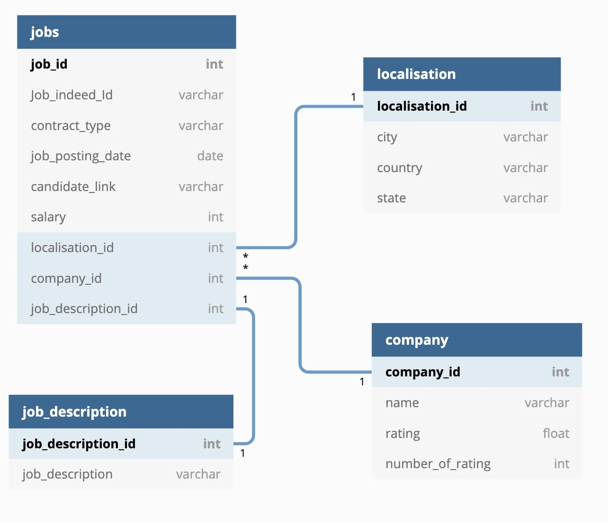

# Indeed is Beautiful

A Python scrapper to retrieve and store information about jobs available on Indeed.
This scrapper is part of ITC project.

## Description

The script presented is a scrapper which, from a keyword, 
a location (in the USA) and a number of pages, retrieves 
information associated with job offers posted on the Indeed.com 
website: company, position, salary, description...

The scraped data is stored in a MySQL Database.

## Installation 

First, install the packages from requirements.txt
    
## Usage/Examples

### Database setup

First, open config file and insert personal informations about your local database.

Then, run db_creator.py file to create a local "indeed" database. Once indeed database is created,
run tables_creator.py to create associated tables. 

This should create a database as follow :

The database is composed of four tables: jobs, localisation, job_description and company. 

The localisation table contains the city, country and state of the Indeed job offer we scrap.

The company table contains the name of the company offering the job as well as the rating and number of ratings of the company. 

The job description table contains the job description of the job offers scrapped. 

Finally, the jobs table contains the Indeed id of the job offer as well as the contract type, job posting date, salary and candidate link (application link) of the job offered on Indeed.
The jobs table also contains foreign keys to the three other tables. 

### How to use this script ?

!!! Before to use this script, be sure to add your personal informations in config file

The main.py script admits 3 arguments:
- the searched keyword (for example: Python, Gardener, Librarian...), of type string: by default: Data+Science
- the desired work location (for example: Washington, Dallas, Texas...), of type string: default: United+States
- the number of pages to be scanned, of type integer; default: 4.

When strings consist of compound words, for example New York, replace the space with a "+": New+York

For example, to search for a PHP developer job in Las Vegas, and get only the first 2 pages of results:

main.py Developer+PHP Las+Vegas 2

### What do I got ?

The script returns the following information for each offer:
job_id, company_name, company_location, contract_type, company_rating_score, 
number_of_ratings, job_posting_date, job_description, candidate_link,
salary.

All this information is stored in the indeed database created.

## Tech Stack

Full Python !
MySql Database
  
## Roadmap

In the future, this script will be improved, by :
- automating the execution of the script
  
## Authors

- @alexisdata
- @garyrouch

  
## License

MIT License

Copyright (c) 2021 Alex&Gary

Permission is hereby granted, free of charge, to any person obtaining a copy
of this software and associated documentation files (the "Software"), to deal
in the Software without restriction, including without limitation the rights
to use, copy, modify, merge, publish, distribute, sublicense, and/or sell
copies of the Software, and to permit persons to whom the Software is
furnished to do so, subject to the following conditions:

The above copyright notice and this permission notice shall be included in all
copies or substantial portions of the Software.

THE SOFTWARE IS PROVIDED "AS IS", WITHOUT WARRANTY OF ANY KIND, EXPRESS OR
IMPLIED, INCLUDING BUT NOT LIMITED TO THE WARRANTIES OF MERCHANTABILITY,
FITNESS FOR A PARTICULAR PURPOSE AND NONINFRINGEMENT. IN NO EVENT SHALL THE
AUTHORS OR COPYRIGHT HOLDERS BE LIABLE FOR ANY CLAIM, DAMAGES OR OTHER
LIABILITY, WHETHER IN AN ACTION OF CONTRACT, TORT OR OTHERWISE, ARISING FROM,
OUT OF OR IN CONNECTION WITH THE SOFTWARE OR THE USE OR OTHER DEALINGS IN THE
SOFTWARE.
